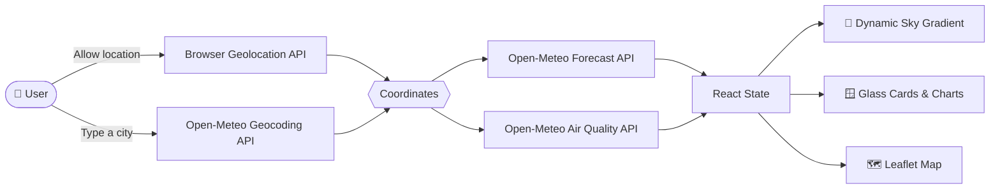

<div align="center">
<a id="top"></a>


### 🌤️ A glassmorphism weather dashboard where the sky itself is the interface

Live conditions · Hourly & 7-day forecasts · Sunrise/sunset arc · Dynamic sky backgrounds

<br />

[](https://strong-basbousa-e70b9a.netlify.app/)
[](https://github.com/Iam-abdulahad/SumuWeather)


</div>

---

## 📑 Table of Contents

- [About the Project](#about)
- [Preview](#preview)
- [Features](#features)
- [Tech Stack](#tech-stack)
- [How It Works](#how-it-works)
- [Design System](#design-system)
- [Getting Started](#getting-started)
- [Available Scripts](#scripts)
- [Project Structure](#project-structure)
- [Accessibility & Performance](#accessibility)
- [Roadmap](#roadmap)
- [Contributing](#contributing)
- [License](#license)
- [Author](#author)
- [Acknowledgements](#acknowledgements)

<div align="right"><a href="#top">⬆ back to top</a></div>

---

## <a id="about"></a>🌈 About the Project

**SuMo Weather** is a weather dashboard built around one idea: *you are looking through weather at more weather.*

Every card is a pane of frosted glass floating over a **live, slowly shifting sky**. The background gradient is driven by real data, meaning the current condition and time of day at the location you're viewing. Sunny noon looks nothing like a stormy evening, and the interface changes with it.

It runs entirely in the browser with **no backend and no API keys**. Weather, geocoding, and air quality all come from the free, keyless [Open-Meteo](https://open-meteo.com/) APIs, so anyone can clone it and run it in under a minute.

> **Why it exists:** SuMo Weather is a front-end craft project. It shows live API integration, motion design, responsive layout, and accessibility working together in one usable app.

<div align="right"><a href="#top">⬆ back to top</a></div>

---

## <a id="preview"></a>📸 Preview

<div align="center">


<br />

**👉 [Try it live](https://strong-basbousa-e70b9a.netlify.app/)**

</div>

<div align="right"><a href="#top">⬆ back to top</a></div>

---

## <a id="features"></a>✨ Features

### 🌦️ Weather at a glance

| Feature | Description |
| --- | --- |
| 📍 **Use my location** | One tap to load local weather with the browser Geolocation API. |
| 🔎 **City search with autocomplete** | Search any city worldwide, powered by the Open-Meteo Geocoding API. |
| 🌡️ **Current conditions** | Temperature, feels-like, condition and icon, humidity, wind speed and direction, pressure. |
| ⏱️ **24-hour hourly forecast** | A horizontally scrollable strip of the next 24 hours. |
| 📅 **7-day forecast** | A clean daily outlook with highs and lows. |
| 🌅 **Sunrise / sunset arc** | An SVG arc with a sun marker showing where the sun is right now. |
| 🔁 **Unit toggle** | Switch °C / °F and km/h / mph instantly, with no reload. |
| 💾 **Recent & saved locations** | Remembered locally in your browser, so no account is needed. |

### 🎨 Look & feel

| Feature | Description |
| --- | --- |
| 🪟 **Glassmorphism UI** | Frosted-glass cards with backdrop blur, laid out in a bento grid. |
| 🌌 **Dynamic sky backgrounds** | Gradients crossfade with the weather condition and day or night. |
| 🎞️ **Purposeful motion** | Spring-based transitions from Framer Motion. Animation answers your actions instead of decorating. |
| 📱 **Fully responsive** | One column on mobile, two on tablet, a full bento grid on desktop. |

### 🚀 Beyond the basics

| Feature | Description |
| --- | --- |
| 🗺️ **Interactive map** | Leaflet and OpenStreetMap tiles for the location you're viewing. |
| 📊 **Charts** | Precipitation and temperature trends drawn with Recharts. |
| 🌬️ **Air quality & UV** | Plain-language risk labels ("Moderate", "High") instead of bare numbers. |
| 📲 **Installable (PWA)** | Add it to your home screen and get an offline cache of the last location. |
| 🖼️ **Share as image** | Export current conditions as a shareable card (via `html2canvas-pro`). |

<div align="right"><a href="#top">⬆ back to top</a></div>

---

## <a id="tech-stack"></a>🛠️ Tech Stack

| Layer | Technology |
| --- | --- |
| **Framework** | [React 18](https://react.dev/) |
| **Build tool** | [Vite 6](https://vitejs.dev/) |
| **Styling** | [Tailwind CSS 3](https://tailwindcss.com/) + PostCSS + Autoprefixer |
| **Animation** | [Framer Motion](https://www.framer.com/motion/) |
| **Charts** | [Recharts](https://recharts.org/) |
| **Maps** | [Leaflet](https://leafletjs.com/) + [React Leaflet](https://react-leaflet.js.org/) |
| **HTTP** | [Axios](https://axios-http.com/) |
| **Icons** | [Lucide React](https://lucide.dev/) · [React Icons](https://react-icons.github.io/react-icons/) |
| **Dialogs** | [SweetAlert2](https://sweetalert2.github.io/) |
| **Utilities** | [react-use](https://github.com/streamich/react-use) · [html2canvas-pro](https://github.com/yorickshan/html2canvas-pro) |
| **PWA** | [vite-plugin-pwa](https://vite-pwa-org.netlify.app/) |
| **Data** | [Open-Meteo](https://open-meteo.com/): forecast, geocoding, and air quality (free, no key) |
| **Tooling** | ESLint 9 (React, Hooks, Refresh plugins) |
| **Hosting** | [Netlify](https://www.netlify.com/) |

<div align="right"><a href="#top">⬆ back to top</a></div>

---

## <a id="how-it-works"></a>⚙️ How It Works



**First visit flow**

1. The browser asks for your location. If you allow it, the dashboard loads local weather straight away.
2. If you decline, it falls back to a search prompt, so the app never dead-ends.
3. Pick a city and the sky crossfades to the new conditions while every card updates.
4. Flip the unit toggle and all values convert instantly on the client.

<div align="right"><a href="#top">⬆ back to top</a></div>

---

## <a id="design-system"></a>🎨 Design System

The design brief was simple: **one bold moment, everything else disciplined.** The live sky is the signature, and the rest stays quiet around it.

### Palette

| Token | Hex | Used for |
| --- | --- | --- |
| ☁️ **Cloud White** | `#F5F7FA` | Primary text on glass |
| 🌑 **Deep Atmosphere** | `#0B1526` | Night background, scrims |
| 🔥 **Amber Flare** | `#FFB454` | Primary accent, current temp, focus ring |
| 🔮 **Storm Violet** | `#7C6FF0` | Secondary accent, charts, night highlights |
| 🚨 **Signal Red** | `#FF6B6B` | Severe weather alerts only |

### Sky gradients

| Condition | Gradient |
| --- | --- |
| ☀️ Clear day | `#4FA8E0` → `#8FD3F4` |
| 🌙 Clear night | `#0B1526` → `#1B2A4A` |
| ☁️ Cloudy | `#6B7B8C` → `#9AA7B0` |
| 🌧️ Rain | `#33465A` → `#56707E` |
| ⛈️ Storm | `#241B3A` → `#443A66` |
| ❄️ Snow | `#B9CBDA` → `#E7F0F7` |

### Typography

- **Space Grotesk** for the big numerals: the hero temperature and hourly readouts.
- **Inter** for everything else: labels, body text, and forecast lists.

### Glass surface

```css
background: rgba(255, 255, 255, 0.12);
border: 1px solid rgba(255, 255, 255, 0.25);
backdrop-filter: blur(20px);
border-radius: 20px;
```

Full details live in [`style.md`](./style.md).

<div align="right"><a href="#top">⬆ back to top</a></div>

---

## <a id="getting-started"></a>🚀 Getting Started

### Prerequisites

- **Node.js** 18 or newer
- **npm** (bundled with Node)

### Installation

```bash
# 1. Clone the repository
git clone https://github.com/Iam-abdulahad/SumuWeather.git

# 2. Move into the project
cd SumuWeather

# 3. Install dependencies
npm install

# 4. Start the dev server
npm run dev
```

Open the URL Vite prints (usually `http://localhost:5173`) and allow location access.

> 🔑 **No `.env` file and no API keys are needed.** Every data source is free and keyless.

### Build for production

```bash
npm run build     # outputs to /dist
npm run preview   # serve the production build locally
```

### Deploy to Netlify

| Setting | Value |
| --- | --- |
| Build command | `npm run build` |
| Publish directory | `dist` |

<div align="right"><a href="#top">⬆ back to top</a></div>

---

## <a id="scripts"></a>📜 Available Scripts

| Command | What it does |
| --- | --- |
| `npm run dev` | Start the Vite dev server with hot reload |
| `npm run build` | Create an optimized production build |
| `npm run preview` | Preview the production build locally |
| `npm run lint` | Lint the codebase with ESLint |

<div align="right"><a href="#top">⬆ back to top</a></div>

---

## <a id="project-structure"></a>🗂️ Project Structure

```text
SumuWeather/
├── public/              # Static assets and PWA icons
├── screenshots/         # Project screenshots
├── src/                 # React components, hooks, and styles
├── index.html           # App entry point
├── vite.config.js       # Vite + PWA configuration
├── tailwind.config.js   # Tailwind theme and design tokens
├── postcss.config.js    # PostCSS setup
├── eslint.config.js     # ESLint flat config
├── PRD.md               # Product requirements
├── style.md             # Design system and visual direction
└── package.json
```

<div align="right"><a href="#top">⬆ back to top</a></div>

---

## <a id="accessibility"></a>♿ Accessibility & Performance

SuMo Weather is built to these targets:

| Area | Target |
| --- | --- |
| **Performance** | First Contentful Paint under 2s, Lighthouse Performance ≥ 90 |
| **Contrast** | WCAG AA, checked per sky state rather than assumed |
| **Keyboard** | Full keyboard navigation with a visible Amber focus ring |
| **Motion** | `prefers-reduced-motion` disables particles and gradient crossfades |
| **Screen readers** | Icons carry text labels, so "Partly cloudy" rather than just a glyph |
| **Touch** | Tap targets of at least 44px on mobile |
| **Responsive** | 320px to 1920px |
| **Browsers** | Latest Chrome, Firefox, Safari, and Edge |

Errors are handled in the app's own voice, with clear states for denied geolocation, no search results, and API downtime.

<div align="right"><a href="#top">⬆ back to top</a></div>

---

## <a id="roadmap"></a>🧭 Roadmap

- [x] Location search with autocomplete and "use my location"
- [x] Current conditions, hourly forecast, and 7-day forecast
- [x] Sunrise/sunset arc
- [x] Dynamic sky backgrounds
- [x] Glassmorphism redesign
- [x] Interactive map, charts, and air quality / UV
- [x] PWA support and share-as-image
- [ ] Severe weather alerts where a free source covers the region
- [ ] Multi-location comparison view
- [ ] Precipitation radar overlay
- [ ] Automated tests and CI

Have an idea? [Open an issue](https://github.com/Iam-abdulahad/SumuWeather/issues).

<div align="right"><a href="#top">⬆ back to top</a></div>

---

## <a id="contributing"></a>🤝 Contributing

Contributions, issues, and feature requests are welcome.

1. **Fork** the project
2. **Create** your feature branch: `git checkout -b feature/amazing-feature`
3. **Commit** your changes: `git commit -m "Add amazing feature"`
4. **Push** to the branch: `git push origin feature/amazing-feature`
5. **Open** a Pull Request

Please run `npm run lint` before submitting.

<div align="right"><a href="#top">⬆ back to top</a></div>

---

## <a id="license"></a>📄 License

Distributed under the **MIT License**. See [`LICENSE`](./LICENSE) for details.

<div align="right"><a href="#top">⬆ back to top</a></div>

---

## <a id="author"></a>👨‍💻 Author

**Md Ahad Ali**, MERN Stack / Full Stack Web Developer

[](https://github.com/Iam-abdulahad)

<div align="right"><a href="#top">⬆ back to top</a></div>

---

## <a id="acknowledgements"></a>🙏 Acknowledgements

- [Open-Meteo](https://open-meteo.com/) for the free, open weather, geocoding, and air quality APIs (data under [CC BY 4.0](https://creativecommons.org/licenses/by/4.0/))
- [OpenStreetMap](https://www.openstreetmap.org/copyright) contributors for the map tiles
- [Leaflet](https://leafletjs.com/), [Recharts](https://recharts.org/), and [Framer Motion](https://www.framer.com/motion/) for the tools that make the UI possible
- [Lucide](https://lucide.dev/) and [React Icons](https://react-icons.github.io/react-icons/) for iconography

---

<div align="center">

**If you like SuMo Weather, please consider giving it a ⭐**

Made with ☕, 🌧️, and a lot of glass.


</div>
